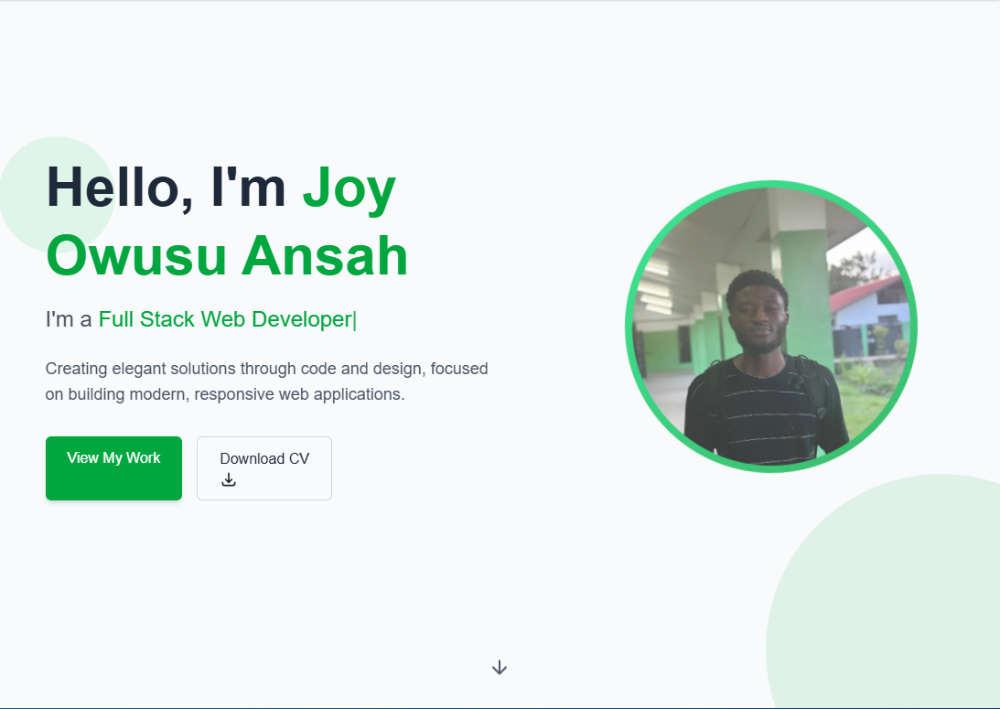

# Portfolio Website



## 📌 Overview

A modern, responsive portfolio website built with Next.js, featuring a contact form backed by Node.js, Supabase for data storage, and Nodemailer for email notifications. This project was developed as part of the Future Interns Fullstack Web Development program.

## ✨ Features

- **Responsive Design**: Optimized for all device sizes
- **Modern UI**: Built with modern design principles
- **Dynamic Content**: Server-side rendered content for optimal performance
- **Contact Form**: Fully functional contact form with validation
- **Email Notifications**: Automated email notifications when forms are submitted
- **Data Storage**: Secure storage of contact submissions using Supabase

## 🛠️ Technologies

- **Frontend**: Next.js, React, Tailwind CSS
- **Backend**: Node.js, Express
- **Database**: Supabase
- **Email Service**: Nodemailer
- **Deployment**: Vercel

## 🚀 Live Demo

[View Live Demo](https://your-portfolio-url.vercel.app)


## 🏗️ Installation & Setup

1. **Clone the repository**
   ```bash
   git clone https://github.com/aduuuna/FUTURE_FS_01.git
   cd portfolio-website
   ```

2. **Install dependencies**
   ```bash
   npm install
   ```

3. **Set up environment variables**
   
   Create a `.env` file in the root directory with the following variables:
   ```env
   # Supabase
   NEXT_PUBLIC_SUPABASE_URL=your-supabase-url
   NEXT_PUBLIC_SUPABASE_ANON=your-supabase-anon-key
   
   # Email
   EMAIL_USER=your-email@example.com
   EMAIL_PASSWORD=your-email-password
   NOTIFICATION_EMAIL=smtp.example.com

   ```

4. **Run the development server**
   ```bash
   npm run dev
   ```

5. **Build for production**
   ```bash
   npm run build
   ```


```

## 🔧 Development Challenges & Solutions

### Middleware Implementation Issue

**Challenge**: Encountered deployment errors on Vercel due to middleware implementation with Supabase.

**Solution**: Identified the use of a deprecated Supabase function in the middleware and updated to the latest API. This fixed the deployment issues and improved overall stability.

### Email Notification System

**Challenge**: Setting up reliable email notifications for form submissions.

**Solution**: Implemented Nodemailer with proper error handling and confirmation messages, ensuring users receive acknowledgment of their submissions.

## 🤝 Contributing

Contributions, issues, and feature requests are welcome! Feel free to check the [issues page](https://github.com/aduuuna/FUTURE_FS_01/issues).

## 📝 License

This project is [MIT](LICENSE) licensed.

## 👤 Author

- GitHub: [@aduuuna](https://github.com/aduuuna)
- LinkedIn: [Joy Owusu Ansah](https://linkedin.com/in/yourprofile)

---

⭐️ From [Joy Owusu Ansah](https://github.com/aduuuna)